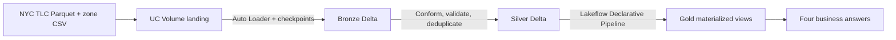
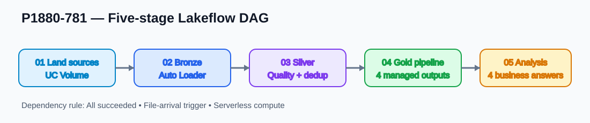
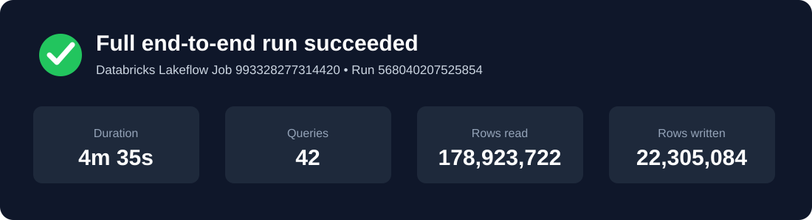
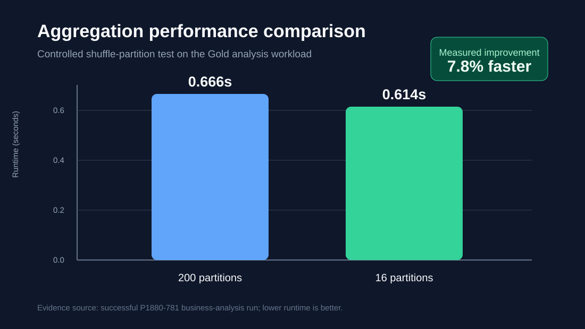

# NYC Taxi Incremental Lakehouse

Databricks implementation for P1880-781 using NYC TLC yellow and green taxi data for October-December 2024 (11M+ trips). The project is deliberately separated into replayable ingestion, quality-controlled curation, declarative Gold serving, and business analysis.

## Processing path

## Repository layout

- `src/notebooks/01_setup_and_land.py` - idempotent landing of the seven source files
- `src/notebooks/02_bronze_autoloader.py` - incremental Auto Loader ingestion
- `src/notebooks/03_silver_quality.py` - common schema, validation and deduplication
- `src/pipelines/04_gold_pipeline.py` - Lakeflow Declarative Pipeline definitions and expectations
- `src/notebooks/05_business_answers.py` - required analytical outputs and tuning comparison
- `resources/databricks.yml` - deployable five-stage workflow definition
- `docs/TECHNICAL_HANDS_ON_RUNBOOK.md` - detailed manual build and operating procedure
- `docs/AZURE_MIGRATION.md` - same implementation path for Azure Databricks
- `docs/JIRA_SUBMISSION.md` - final Jira description, comment order, attachment manifest and completion status
- `evidence/` - verified counts, run IDs and direct workspace resources

## Verified result

Bronze ingested 11,148,511 yellow and 162,363 green records without duplicate accumulation on rerun. Silver removed four duplicate records and passed mandatory-null and uniqueness assertions. Gold published zone, enriched-trip, hourly-zone and daily-payment outputs. The final five-task workflow completed successfully in 4 minutes 35 seconds (run `568040207525854`), covering landing, Bronze, Silver, Gold and business analysis in one dependency graph.

## Execution evidence

## Run

Follow `docs/TECHNICAL_HANDS_ON_RUNBOOK.md`. The intended order is landing -> Bronze -> Silver -> Gold pipeline -> business analysis. No credentials or workspace-specific secrets are stored in this repository.
