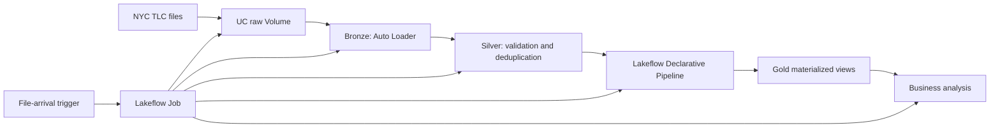

# P1880-781 — NYC Taxi Lakehouse Hands-on Runbook

## Purpose and architecture

This runbook reproduces the assignment manually in Databricks official cloud and provides the controls needed for a later Azure Databricks migration.

## Live Databricks resources

- Gold pipeline — `P1880-781 NYC Taxi Gold`: https://dbc-fa972b8c-fd14.cloud.databricks.com/editor/files/2665563075879901?pipelineId=2d0d93cb-a503-4cb6-90b4-b6dc992d1ab2&autoConnectPipeline=true&contextId=pipeline%3A2d0d93cb-a503-4cb6-90b4-b6dc992d1ab2&o=7474659918792478
- Pipeline ID: `2d0d93cb-a503-4cb6-90b4-b6dc992d1ab2`
- Lakeflow Job — `P1880-781 NYC Taxi Lakehouse`: https://dbc-fa972b8c-fd14.cloud.databricks.com/jobs/993328277314420/tasks?o=7474659918792478
- Job ID: `993328277314420`
- Successful run: https://dbc-fa972b8c-fd14.cloud.databricks.com/jobs/993328277314420/runs/980778669583774?o=7474659918792478
- Run ID: `980778669583774`
- Catalog/schema: `workspace.taxi_tanvir`
- Raw Volume: `/Volumes/workspace/taxi_tanvir/raw/`
- Workspace sources: `/Workspace/Users/md.tanvir@bjitgroup.com/P1880-781/`
- Version-controlled source: https://github.com/tanvir4hmed/data-pipeline

Workspace access is required to open the links.



## Prerequisites

- Databricks workspace with serverless compute and Unity Catalog access.
- Permission to create schema, Volume, tables, pipeline, and job.
- Catalog `workspace`, schema `taxi_tanvir`, Volume `raw` (or approved equivalents).
- Workspace folder containing the supplied notebooks in numeric order.

## Source data

Use October–December 2024 NYC TLC Yellow and Green Taxi Parquet files plus `taxi_zone_lookup.csv` from `https://d37ci6vzurychx.cloudfront.net`.

Expected scale: Yellow 11,148,511 rows; Green 162,363 rows; zones 265 rows.

## Manual procedure

### 1. Land files

Run `notebooks/01_setup_and_land.py`.

It creates the schema and UC Volume, builds the seven-file manifest, skips existing destinations, streams missing HTTP objects directly to the Volume, and validates expected filenames. Filename validation is deliberate: Auto Loader may add metadata entries, so asserting that the Volume has exactly seven entries is unsafe.

Verify that all seven filenames display. Rerun the notebook; every file should be skipped and no duplicate copy should appear.

### 2. Build Bronze

Run `notebooks/02_bronze_autoloader.py`.

It uses Auto Loader with persistent schema/checkpoint locations for the six Parquet sources and loads the zone CSV as reference data. Source lineage comes from `_metadata.file_path`; do not replace it with `input_file_name()` on serverless compute.

Verify the expected row counts, then rerun. Counts must remain unchanged because processed files are tracked by the checkpoint.

### 3. Build Silver

Run `notebooks/03_silver_quality.py`.

The transformation standardizes Yellow/Green schemas, casts timestamps and numeric fields, adds `taxi_type`, rejects invalid timestamps/distances/zones, removes deterministic duplicates, and writes clean Delta data. Four duplicate records were removed in the validated run and all assertions passed.

Useful validation:

```sql
SELECT taxi_type, COUNT(*) FROM workspace.taxi_tanvir.silver_trips GROUP BY taxi_type;
SELECT COUNT(*) FROM workspace.taxi_tanvir.silver_trips
WHERE pickup_datetime IS NULL OR dropoff_datetime <= pickup_datetime OR trip_distance <= 0;
```

The second query must return zero.

### 4. Create Gold pipeline

In **Jobs & Pipelines**, create an ETL/declarative pipeline named `P1880-781 NYC Taxi Gold` using `pipelines/04_gold_pipeline.py`, target `workspace.taxi_tanvir`, and serverless compute. Validate first, then run a full refresh.

Confirm these objects: `dim_zone`, `gold_trips_enriched`, `gold_zone_hour`, and `gold_payment_daily`. Confirm at least two expectations in the data-quality view. Validated pipeline ID: `2d0d93cb-a503-4cb6-90b4-b6dc992d1ab2`.

### 5. Run analysis

Run `notebooks/05_business_answers.py`. Reference results:

- JFK: 480,149 trips; average fare 64.9424; card-tip rate 21.1278%.
- LGA: 328,712 trips; average fare 45.1467; card-tip rate 26.0883%.
- Midtown Center peak: 18:00, 42,349 trips.
- Manhattan: 7,469,561 trips, 76.7688% share.
- Yellow Manhattan: median distance 1.59, duration 12.7667 minutes, average revenue 24.4718.
- Green Manhattan: median distance 1.81, duration 11.6833 minutes, average revenue 22.2171.

Material differences indicate a source, filter, join, or deduplication problem.

### 6. Validate performance

Run the notebook's controlled repartitioning comparison in one session. Validated result: 200 shuffle partitions took 0.666s; 16 took 0.614s (about 7.8% faster, 14 output partitions). Treat short serverless timings as directional and retain both measurements.

### 7. Configure orchestration

Create the serverless job `P1880-781 NYC Taxi Lakehouse` as a complete five-stage dependency graph:

| Task | Notebook | Dependency |
|---|---|---|
| `01_land_sources` | corrected `01_setup_and_land` | None |
| `02_bronze` | `02_bronze_autoloader` | `01_land_sources` |
| `03_silver` | `03_silver_quality` | `02_bronze` |
| `04_gold_pipeline` | existing Lakeflow pipeline `2d0d93cb-a503-4cb6-90b4-b6dc992d1ab2` | `03_silver` |
| `05_business_answers` | `05_business_answers` | `04_gold_pipeline` |

Add an active **File arrival** trigger using storage type **Volumes** and the raw UC Volume as its location. Validated Job ID: `993328277314420`.

The original validated run (`980778669583774`) covers the first three tasks and remains useful execution evidence. Extend the same job with the Gold pipeline task and analysis task, then run the full DAG and retain the new run ID. Run it again and confirm unchanged source files do not change Bronze counts.

### 8. Connect version control

The source of record is `https://github.com/tanvir4hmed/data-pipeline`. In Databricks, open **Workspace > Repos**, add the repository URL, and use the default branch. Keep notebook and pipeline paths aligned with `src/`. The repository also contains `resources/databricks.yml`, a deployable representation of the same five-stage DAG. Do not commit workspace credentials, tokens, raw source files, checkpoints, or generated data.

For a controlled change: create a short-lived branch, update one notebook, validate it in Databricks, commit with a focused message, and merge only after the pipeline and data-quality checks pass.

## Idempotency checklist

1. No numbered/duplicate source files exist.
2. Bronze counts remain stable on unchanged input.
3. Silver business keys contain no duplicates.
4. Gold objects rebuild without conflicting-table errors.
5. Business totals remain stable.

## Troubleshooting

- **More than seven Volume entries:** Auto Loader metadata may exist; validate required filenames, not directory-entry count.
- **Driver-local access error:** do not stage through `/tmp`; stream directly into the UC Volume.
- **Source filename error:** use `F.col("_metadata.file_path")`.
- **Gold cannot find Silver:** verify fully qualified catalog/schema names and run Silver first.
- **Python syntax error near SQL:** preserve `# COMMAND ----------` between Python and `%sql` cells.
- **Unexpected Bronze growth:** inspect checkpoint and schema locations before another run.

## Azure Databricks recreation

1. Provision/select the Azure workspace and UC metastore.
2. Choose the approved Azure catalog/schema.
3. Choose UC Volume or ADLS Gen2 external location for landing.
4. If ADLS is used, configure storage credential, external location, and identity access.
5. Update only catalog, schema, landing path, and identity settings.
6. Import the same files individually and run Land, Bronze, and Silver.
7. Recreate the declarative pipeline, expectations, five-task job, and file-arrival trigger.
8. Repeat row-count, quality, performance, business-result, and idempotency checks.
9. Store Azure run IDs/evidence separately from official-cloud evidence.

See `../for_azure/README.md` for Azure-specific planning notes and `evidence/RUN_RESULTS.md` for verified execution results.

## Completion checklist

- [ ] Seven sources landed and rerun-safe
- [ ] Bronze Auto Loader counts verified twice
- [ ] Silver quality and deduplication passed
- [ ] Gold pipeline and 2+ expectations passed
- [ ] Four business questions answered
- [ ] Performance comparison recorded
- [ ] Five-task end-to-end Job and file-arrival trigger verified
- [ ] GitHub repository connected and reproducible from README/runbook
- [ ] Evidence files retained individually
